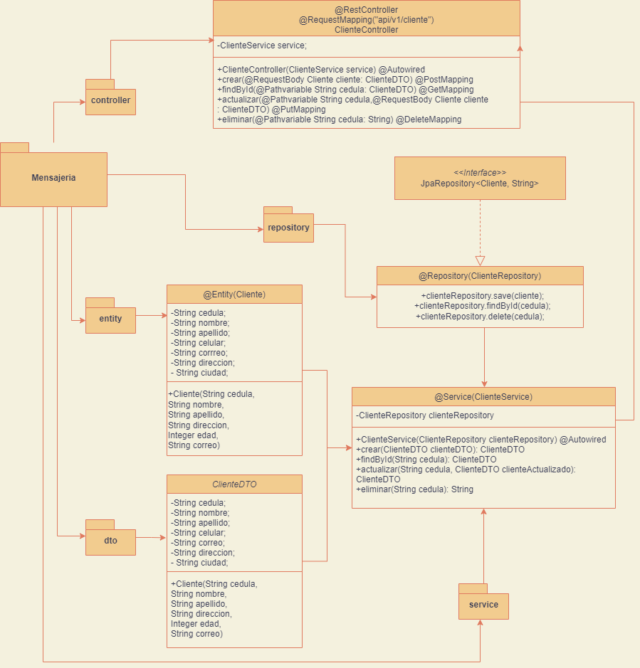
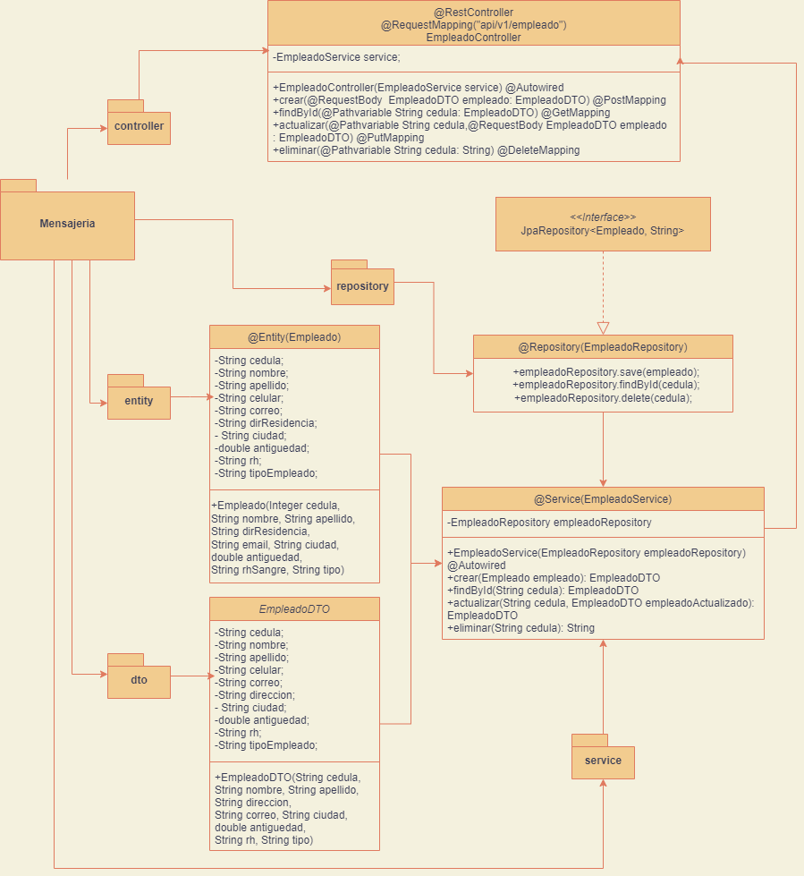
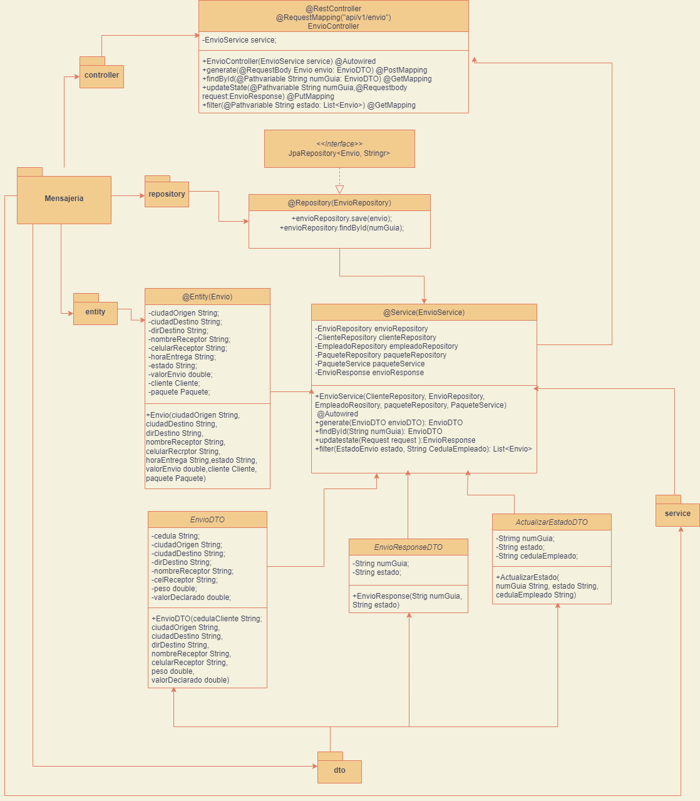

# ProyectoIntegrador: API de Mensajería 📦📬
Esta API proporciona funcionalidades para gestionar envíos de paquetes de una empresa de mensajeria. Desarrollado en Java usando SpringBoot, JPA, Swagger, Spring Security, MySQL, Hibernate, insomnia, entre otras tecnologias 🐬🔬📱. Este proyecto cuenta con integración continua (CI) utilizando GitHub Actions para la ejecución automática de pruebas y validaciones de calidad de código 🔧💻. Además, se ha implementado una integración continua y entrega continua (CI/CD) con Railway para el despliegue automatizado de la aplicación en un servidor cloud. De esta manera, se asegura una entrega rápida y confiable de nuevas versiones de la API🔒.

## Instalación 🚀

1. Clonar el repositorio: `git clone https://github.com/Pipe1098/ProyectoIntegrador.git`
2. Abra el proyecto con su IDE preferido (Eclipse, IntelliJ, etc.).
3. Configure el archivo application.properties en la ruta src/main/resources para conectarse a la base de datos H2 en memoria. Puede dejar la configuración por defecto o cambiarla según sus necesidades.
4. Ejecute el comando gradle build para descargar las dependencias del proyecto y compilarlo.
5. Ejecute el comando gradle bootRun para iniciar la aplicación.

## Despliegue 🛫💻
### Pudes probar la API mediante el siguiente link: 
- [https://api-MensaeriaExpress.co](https://proyectointegrador-production-9aac.up.railway.app/swagger-ui/index.html#/)

### Usando los siguientes datos de autenticación:
- Perfil 1: solo lectura (peticiones GET)
   
   Usuario: user
   
   Contraseña: user123
  
 - Perfil 2: todas las (peticiones GET, POST, PUT, DELETE)
   
   Usuario: admin
   
   Contraseña: admin123
   
### Tambien puede probar la API utilizando una herramienta como Insomnia. Estos son algunos ejemplos de solicitudes que puede realizar:

## 🧑‍💼 Endpoint: POST /URL: http://localhost:8080/api/v1/cliente
 ### Registra un nuevo cliente en el sistema.
- Cuerpo de la solicitud /json: 
```json
{
  "apellido": "Alzate",
  "cedula": "2563985478",
  "celular": "3012569845",
  "ciudad": "MedellÍn",
  "correo": "Santi@gmail.com",
  "direccion": "Cr 25-48",
  "nombre": "Santiago"
}
```
-Ejemplo de respuesta exitosa:
```json
{
	"nombre": "Santiago",
	"apellido": "Alzate",
	"celular": "3012569845",
	"correo": "Santi@gmail.com",
	"cedula": "2563985478",
	"ciudad": "MedellÍn",
	"direccion": "Cr 25-48"
}
```
## 👷🏻‍♂️ 📔 👨‍👩‍👧‍👧 POST /URL: http://localhost:8080/api/v1/empleado
### Registra un nuevo empleado en el sistema.
- Cuerpo de la solicitud /json: 
```json
{
  "antigueadadEnEmpresa": 9,
  "apellido": "Gonzales",
  "cedula": "9865321478",
  "celular": "3025698741",
  "ciudad": "Ibagué",
  "correo": "Esteban@gmail.com",
  "direccion": "Cr 55 # 34 -98",
  "id": 0,
  "nombre": "Esteban",
  "rh": "AB",
  "tipoEmpleado": "CONDUCTOR"
}
```
-Ejemplo de respuesta exitosa:
```json
{
	"cedula": "9865321478",
	"apellido": "Gonzales",
	"nombre": "Esteban",
	"correoElectronico": "Esteban@gmail.com",
	"celular": "3025698741",
	"tipoEmpleado": "CONDUCTOR",
	"antiguedadEnEmpresa": 9
}
```
## 📦✅ Endpoint: POST/URL: http://localhost:8080/api/v1/envio
### Crea un nuevo envío.

Parámetros:
* cedularequerido): la cedula del cliente (debe ser único)
 * nombreDestinatario (requerido): el nombre completo del destinatario
* direccionDestinatario (requerido): la dirección del destinatario
* celDestinatario (requerido): el teléfono del destinatario
* valorDeclarado (requerido): valor asignado al paquete
* pesoPaquete (requerido): el peso del paquete en kilogramos (debe ser mayor a 0)

- Ejemplo de la petición:
```json
{
  "cedula": "2563985478",
  "cedulaEmpleado": "9865321478",
  "celReceptor": "3005698798",
  "ciudadDestino": "Cali",
  "ciudadOrigen": "Pasto",
  "dirDestino": "Cr 43 -67",
  "nombreReceptor": "Pedro",
  "peso": 2,
  "valorDeclarado": 60000
}
```
- Ejemplo de respuesta:
Status code: 200 OK
Content-Type: application/json

```json
{
 "numeroGuia":"f7a20c7df5", "estadoEnvio":"RECIBIDO"
}
```

## 📜📋 Endpoint: GET/URL: http://localhost:8080/api/v1/envios 
### Recupera todos los envíos existentes.

- Ejemplo de respuesta exitoso:

Status code: 200 OK
Content-Type: application/json
```json
[
  {
    "numeroGuia": "1234567890",
    "nombreDestinatario": "Juan Perez",
    "direccionDestinatario": "Calle 123, Ciudad",
    "telefonoDestinatario": "555-1234",
    "descripcionPaquete": "Caja grande",
    "pesoPaquete": 2.5,
    "fechaEnvio": "2022-04-18T18:25:43.511Z",
    "estadoEnvio": "EN_TRANSITO"
  },
  {
    "numeroGuia": "0987654321",
    "nombreDestinatario": "Maria Rodriguez",
    "direccionDestinatario": "Avenida 456, Ciudad",
    "telefonoDestinatario": "555-4321",
    "descripcionPaquete": "Sobre pequeño",
    "pesoPaquete": 0.5,
    "fechaEnvio": "2022-04-19T10:14:59.123Z",
    "estadoEnvio": "ENTREGADO"
  },
  {"...":
    "..."}
]
```
## 📂📦🔍Endpoint: GET/URL: http://localhost:8080/api/v1/envio/numGuia
### Recupera un envío existente por número de guía.

Parámetros
numeroGuia (requerido): el número de guía del envío a buscar.
- Ejemplo de la peticion:
```json
{
  "numeroGuia": "abc4567890"
}
```
- Ejemplo de respuesta exitoso:

Status code: 200 OK
Content-Type: application/json
```json
{
  "numeroGuia": "abc4567890",
  "nombreDestinatario": "Juan Perez",
  "direccionDestinatario": "Calle 123, Ciudad",
  "telefonoDestinatario": "555-1234",
  "descripcionPaquete": "Caja grande",
  "pesoPaquete": 2.5,
  "fechaEnvio": "2022-04-18T18:25:43.511Z",
  "estadoEnvio": "EN_RUTA"
}
```

##  🔄💾 Endpoint: PUT/URL: http://localhost:8080/api/v1/envio/estado
### Actualizar estado de envio.
- Ejemplo de petición:
```json
{
  "cedulaEmpleado": "string",
  "estado": "ENTREGADO",
  "numGuia": "adaf52455"
}
```
- Ejemplo de respuesta:
```json
{
  "estado": "ENTREGADO",
  "numeroGuia": "adaf52455"
}
```
## 🧪👀 Endpoint: GET/URL: http://localhost:8080/api/v1/envios/filtrar
### Filtra los envios por determinado tipo de estado
Requiere la cedula del empleado y el estado al cual se quiere actualizar (por medio de un RequestParam)

- Ejemplo de respuesta:
```json
[
  {
    "cedula": "2156161616",
    "celReceptor": "3002569874",
    "ciudadDestino": "Cali",
    "ciudadOrigen": "Medellin",
    "dirDestino": "cr 45-52",
    "horaEntrega": "2023-04-19T19:01:43.955Z",
    "nombreReceptor": "Juan",
    "peso": 10,
    "valorDeclarado": 100,
    "valorEnvio": 200,
     "EestadoEnvio": "RECIBIDO"
  }
]
```
## ❌🗑️ Endpoint: Delete/URL: http://localhost:8080/api/v1/envio/{id}
### Este endpoint permite eliminar un envio por su id (numeroGuia)
- Respuesta exitosa :

Envio eliminado correctamente.

## 📊📈 Diagramas:
### Diagrama de UML:


### Diagrama de Entidad relacion:


### Diagrama de clases (Cliente, Empleado, Envio):





## 🤝Contribuir
Si deseas contribuir al proyecto, por favor sigue los siguientes pasos:
1. Haz un fork del repositorio
2. Crea una nueva rama con la funcionalidad que deseas agregar
3. Realiza tus cambios
4. Haz un pull request hacia la rama principal del repositorio
## 📃Licencia
Este proyecto está bajo la Licencia MIT - mira el archivo [LICENSE.md](LICENSE.md) para más detalles.


